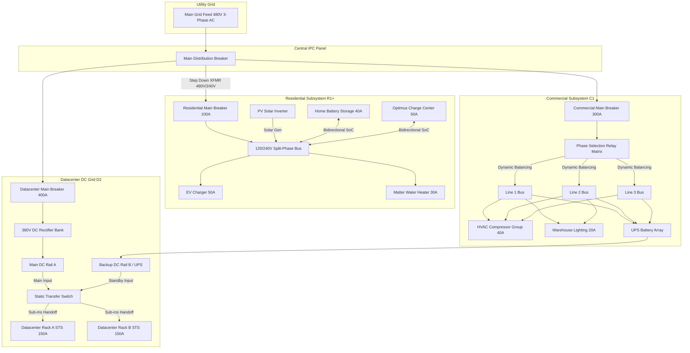
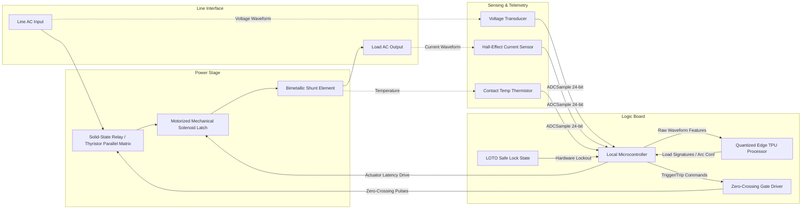

# xAI IPC Electrical Schematics & One-Line Diagrams

This document contains standard electrical one-line diagrams, solid-state breaker circuit block diagrams, and wiring schematics for the **xAI Intelligent Power Core (IPC)**.

---

## 1. System Electrical One-Line Diagram

The one-line diagram represents the power distribution topology across the three supported environments (Residential, Commercial, Datacenter) fed from the main utility grid.




---

## 2. Solid-State Breaker Circuit Block Diagram


This schematic shows the internal components of a single **xAI Intelligent Solid-State Breaker**. It details the separation of control logic, digital sensors, zero-crossing gate triggers, and mechanical overrides.



---

## 3. Solid-State Breaker Wiring Schematic

The schematic below traces the wiring pathways connecting the microcontroller pins, isolating optocouplers, thyristor gates, and the zero-crossing detector.

```text
                                        ZERO-CROSSING SOLID-STATE BREAKER GATE DRIVER
                                       
              +5V -----------------------+-----------------------------+
                                         |                             |
                                        [R1]                          [R2]
                                         |                             |
  (MCU pin 12)  -----> [Optocoupler] ----+                             |
  GATE DRIVE            SFH615A          |                             |
  SIGNAL                                 v LED (Active Low)            |
                                         |                             v
                                         |                        +---------+
                                         |                        |  Zero-  |
                                         +----------------------->| Crossing|----> (MCU pin 4)
                                         |                        | Detector|      ZERO-X INTERRUPT
                                         v                        |  H11AA1 |
  (MCU pin 13)  -----> [Optocoupler] ----+                        +---------+
  RESET SOLENOID        MOC3021          |                             |
                                         +----+                        |
                                              |                        |
                                              v Gate Trigger           v
                                        +----------------------------------+
                                        |      Thyristor Matrix (SSR)      |
                     AC Line In ------->|  Dual SCR antiparallel contacts  |-------> Load Out
                                        +----------------------------------+
                                                         |
                                                 [Bimetallic Shunt]
                                                         |
                                                (Thermal Measurement)
                                                         v
                                                [ADC ADC121S021] ------> SPI Bus to MCU
```

### Wiring Legend:
*   **Gate Drive Signal**: Digital output from the MCU (buffered via SFH615A optocoupler) that triggers the gate of the SCRs.
*   **Zero-Crossing Detector**: The H11AA1 phototransistor outputs a low-pulse interrupt to the MCU exactly when the AC voltage waveform crosses the neutral zero line.
*   **Optocoupler Isolation**: Separates the $5\,\text{V}$ logic side from the $120\,\text{V}/240\,\text{V}$ line power to protect the processing hardware.
*   **Bimetallic Shunt**: Shunt resistor placed in series with the load out, monitored by a 12-bit SPI ADC to read contact temperature and current flow.
